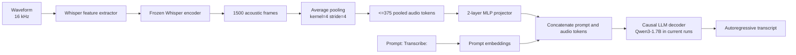
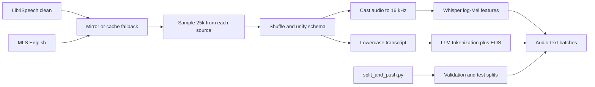
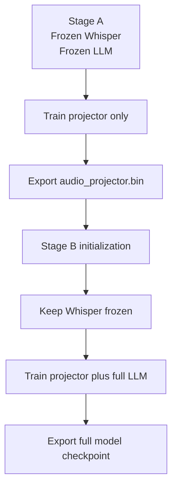
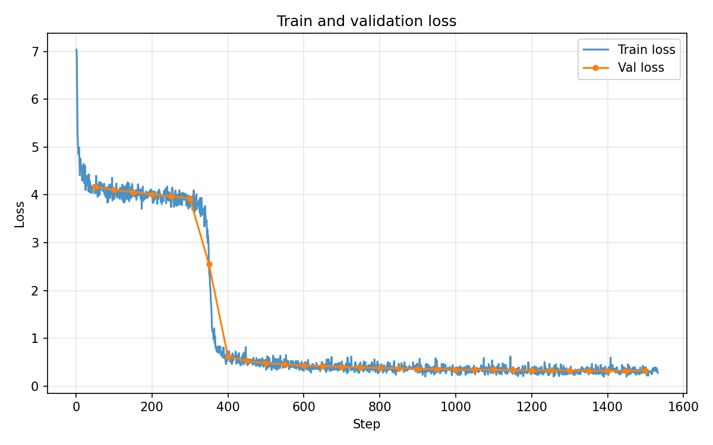
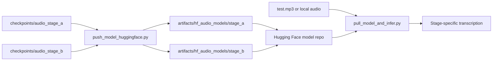

# Hybrid Audio-to-LLM Transcription

> Research-oriented speech transcription system that bridges a frozen Whisper encoder to a causal LLM through pooled audio tokens and a trainable projector.

`transcript = LLM([prompt ; projector(avgpool(whisper(audio)))])`

## At a Glance

| Axis | Implementation |
| --- | --- |
| Task | Autoregressive speech-to-text transcription |
| Acoustic encoder | `openai/whisper-base` |
| Sequence compression | `AvgPool1d(kernel=4, stride=4)` |
| Cross-modal bridge | 2-layer MLP audio projector |
| Decoder | Hugging Face causal LM interface; current runs use `Qwen/Qwen3-1.7B` |
| Data | 50,000 training samples = 25k LibriSpeech + 25k MLS English |
| Curriculum | Stage A projector alignment -> Stage B end-to-end LLM adaptation |
| Packaging | Custom Hugging Face model export with `stage_a` and `stage_b` bundles |

The planning document started from a Llama-based design in [`plan.md`](plan.md); the executable training and export scripts in this repository currently instantiate the same recipe with `Qwen/Qwen3-1.7B`.

## System Architecture

## Data and Training Pipeline

## Two-Stage Optimization Strategy

## Experimental Snapshot

| Stage | Trainable blocks | Epochs | Steps | Runtime | Train loss | Val loss |
| --- | --- | ---: | ---: | ---: | --- | --- |
| Stage A | Projector only | 1 | 1532 | 31.8 min | `7.039 -> 0.275` | `4.165 -> 0.320` |
| Stage B | Projector + Qwen | 3 | 2298 | 55.3 min | `0.389 -> 0.253` | `0.318 -> 0.265` |

| Stage A dynamics | Stage B dynamics |
| --- | --- |
|  |  |

Current committed quantitative evidence in the repository is training and validation loss; a standalone WER benchmark script is not yet checked in.

## Packaging and Inference Path

## Repository Map

| Path | Role |
| --- | --- |
| `plan.md` | Original research and implementation plan |
| `train_audio.py` | Core training loop, dataset preparation, stage control, loss plotting |
| `train_audio_stage_a.sh` | Stage A launcher |
| `train_audio_stage_b.sh` | Stage B launcher |
| `split_and_push.py` | Creates validation and test splits for the mirrored datasets |
| `push_model_huggingface.py` | Packages checkpoints into reusable Hugging Face bundles |
| `pull_model_and_infer.py` | Pulls packaged models and runs transcription on local audio |
| `audio_transcription_config.py` | Custom Hugging Face config for exported models |
| `audio_transcription_model.py` | Custom Hugging Face model class for exported models |

## Operational Entry Points

| Goal | Command |
| --- | --- |
| Train Stage A | `bash train_audio_stage_a.sh` |
| Train Stage B | `bash train_audio_stage_b.sh` |
| Create validation and test splits | `python split_and_push.py` |
| Package model stages | `python push_model_huggingface.py` |
| Compare Stage A vs Stage B inference | `python pull_model_and_infer.py --stage both --audio-path test.mp3` |
